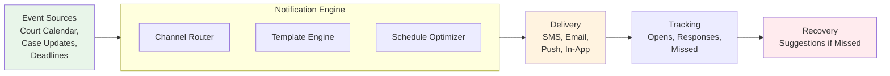

# 📬 Smart Court Notification Engine — Never Miss a Deadline Again

[](LICENSE)
[](https://www.typescriptlang.org/)
[](CONTRIBUTING.md)
[](https://github.com/dougdevitre/court-notification-engine/pulls)

## The Problem

Missed hearings and deadlines are one of the largest drivers of unjust outcomes. Default judgments are entered against people who simply did not know they had to appear. Court reminders are inconsistent, arrive too late, or never come at all. Low-income litigants are disproportionately affected.

## The Solution

**Court Notification Engine** is a multi-channel notification system with deadline prediction, escalation reminders, and missed-action recovery suggestions. It sends the right message, through the right channel, at the right time — and if something is missed, it helps users recover.



## Who This Helps

- **Litigants** who cannot afford to miss a single deadline
- **Court administrators** reducing default judgments and no-shows
- **Legal aid case managers** monitoring client deadlines at scale
- **Judges** seeking better courtroom attendance rates

## Features

- **Multi-channel delivery** — SMS, email, push notifications, and in-app alerts
- **Deadline prediction** from case data and court calendars
- **Escalation reminders** — 3-day, 1-day, and same-day alerts with increasing urgency
- **Missed action recovery** — practical suggestions when a deadline is missed
- **Plain-language notifications** — no legalese, written at accessible reading levels
- **Batch + real-time modes** — daily digests or instant alerts based on urgency

## Quick Start

```bash
npm install @justice-os/notifications
```

```typescript
import { NotificationEngine, EscalationManager } from '@justice-os/notifications';

const engine = new NotificationEngine({
  defaultChannel: 'sms',
  timezone: 'America/Chicago',
});

// Schedule a hearing reminder with escalation
const escalation = new EscalationManager();
escalation.createChain({
  eventId: 'hearing-2024-001',
  eventDate: new Date('2024-04-15T09:00:00'),
  userId: 'user-123',
  reminders: [
    { daysBefore: 7, channel: 'email', template: 'hearing-reminder-7day' },
    { daysBefore: 3, channel: 'sms', template: 'hearing-reminder-3day' },
    { daysBefore: 1, channel: 'sms', template: 'hearing-reminder-1day' },
    { daysBefore: 0, channel: 'push', template: 'hearing-reminder-today' },
  ],
});

// Send a notification
await engine.send({
  userId: 'user-123',
  channel: 'sms',
  template: 'deadline-approaching',
  data: { deadline: 'File your answer', dueDate: '2024-04-10' },
});
```

## Roadmap

| Phase | Feature | Status |
|-------|---------|--------|
| 1 | Notification engine + channel routing | 🔨 In Progress |
| 2 | Template engine (plain-language) | 📋 Planned |
| 3 | Escalation manager (reminder chains) | 📋 Planned |
| 4 | Delivery tracking (opens, responses) | 📋 Planned |
| 5 | Recovery advisor (missed action help) | 📋 Planned |
| 6 | Court calendar integration | 📋 Planned |

## Project Structure

```
src/
├── index.ts
├── engine/
│   ├── notification-engine.ts    # NotificationEngine class
│   ├── scheduler.ts              # NotificationScheduler — timing, batching
│   └── escalation.ts             # EscalationManager — reminder chains
├── channels/
│   ├── sms.ts
│   ├── email.ts
│   ├── push.ts
│   └── in-app.ts
├── templates/
│   ├── template-engine.ts        # TemplateEngine — plain-language rendering
│   └── templates/
│       └── README.md
├── recovery/
│   └── recovery-advisor.ts       # RecoveryAdvisor — missed action suggestions
├── tracking/
│   └── delivery-tracker.ts       # DeliveryTracker — opens, responses
└── types/
    └── index.ts
```

## Contributing

See [CONTRIBUTING.md](CONTRIBUTING.md) for guidelines.

## License

[MIT](LICENSE) — Built for the public good.

---

## Justice OS Ecosystem

This repository is part of the **Justice OS** open-source ecosystem — 32 interconnected projects building the infrastructure for accessible justice technology.

### Core System Layer
| Repository | Description |
|-----------|-------------|
| [justice-os](https://github.com/dougdevitre/justice-os) | Core modular platform — the foundation |
| [justice-api-gateway](https://github.com/dougdevitre/justice-api-gateway) | Interoperability layer for courts |
| [legal-identity-layer](https://github.com/dougdevitre/legal-identity-layer) | Universal legal identity and auth |
| [case-continuity-engine](https://github.com/dougdevitre/case-continuity-engine) | Never lose case history across systems |
| [offline-justice-sync](https://github.com/dougdevitre/offline-justice-sync) | Works without internet — local-first sync |

### User Experience Layer
| Repository | Description |
|-----------|-------------|
| [justice-navigator](https://github.com/dougdevitre/justice-navigator) | Google Maps for legal problems |
| [mobile-court-access](https://github.com/dougdevitre/mobile-court-access) | Mobile-first court access kit |
| [cognitive-load-ui](https://github.com/dougdevitre/cognitive-load-ui) | Design system for stressed users |
| [multilingual-justice](https://github.com/dougdevitre/multilingual-justice) | Real-time legal translation |
| [voice-legal-interface](https://github.com/dougdevitre/voice-legal-interface) | Justice without reading or typing |
| [legal-plain-language](https://github.com/dougdevitre/legal-plain-language) | Turn legalese into human language |

### AI + Intelligence Layer
| Repository | Description |
|-----------|-------------|
| [vetted-legal-ai](https://github.com/dougdevitre/vetted-legal-ai) | RAG engine with citation validation |
| [justice-knowledge-graph](https://github.com/dougdevitre/justice-knowledge-graph) | Open data layer for laws and procedures |
| [legal-ai-guardrails](https://github.com/dougdevitre/legal-ai-guardrails) | AI safety SDK for justice use |
| [emotional-intelligence-ai](https://github.com/dougdevitre/emotional-intelligence-ai) | Reduce conflict, improve outcomes |
| [ai-reasoning-engine](https://github.com/dougdevitre/ai-reasoning-engine) | Show your work for AI decisions |

### Infrastructure + Trust Layer
| Repository | Description |
|-----------|-------------|
| [evidence-vault](https://github.com/dougdevitre/evidence-vault) | Privacy-first secure evidence storage |
| [court-notification-engine](https://github.com/dougdevitre/court-notification-engine) | Smart deadline and hearing alerts |
| [justice-analytics](https://github.com/dougdevitre/justice-analytics) | Bias detection and disparity dashboards |
| [evidence-timeline](https://github.com/dougdevitre/evidence-timeline) | Evidence timeline builder |

### Tools + Automation Layer
| Repository | Description |
|-----------|-------------|
| [court-doc-engine](https://github.com/dougdevitre/court-doc-engine) | TurboTax for legal filings |
| [justice-workflow-engine](https://github.com/dougdevitre/justice-workflow-engine) | Zapier for legal processes |
| [pro-se-toolkit](https://github.com/dougdevitre/pro-se-toolkit) | Self-represented litigant tools |
| [justice-score-engine](https://github.com/dougdevitre/justice-score-engine) | Access-to-justice measurement |
| [justice-app-generator](https://github.com/dougdevitre/justice-app-generator) | No-code builder for justice tools |

### Quality + Testing Layer
| Repository | Description |
|-----------|-------------|
| [justice-persona-simulator](https://github.com/dougdevitre/justice-persona-simulator) | Test products against real human realities |
| [justice-experiment-lab](https://github.com/dougdevitre/justice-experiment-lab) | A/B testing for justice outcomes |

### Adoption Layer
| Repository | Description |
|-----------|-------------|
| [digital-literacy-sim](https://github.com/dougdevitre/digital-literacy-sim) | Digital literacy simulator |
| [legal-resource-discovery](https://github.com/dougdevitre/legal-resource-discovery) | Find the right help instantly |
| [court-simulation-sandbox](https://github.com/dougdevitre/court-simulation-sandbox) | Practice before the real thing |
| [justice-components](https://github.com/dougdevitre/justice-components) | Reusable component library |
| [justice-dev-starter-kit](https://github.com/dougdevitre/justice-dev-starter-kit) | Ultimate boilerplate for justice tech builders |

> Built with purpose. Open by design. Justice for all.
