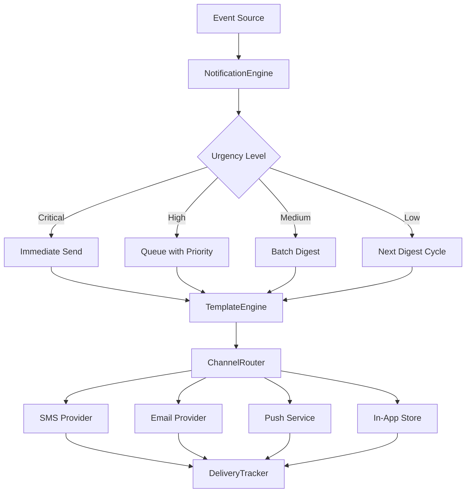
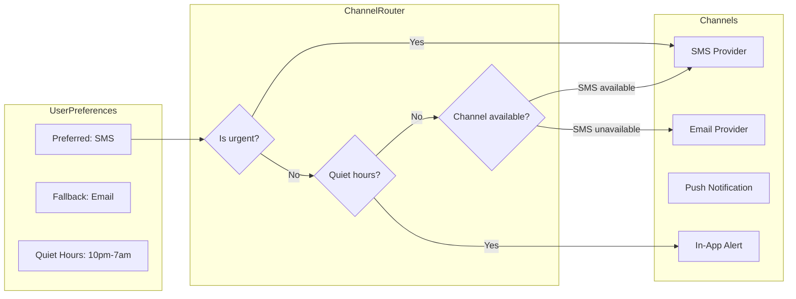
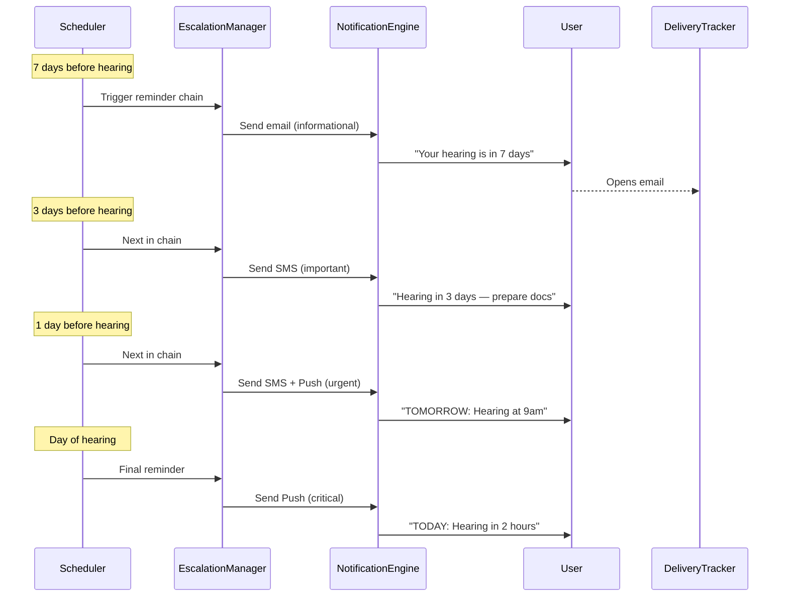
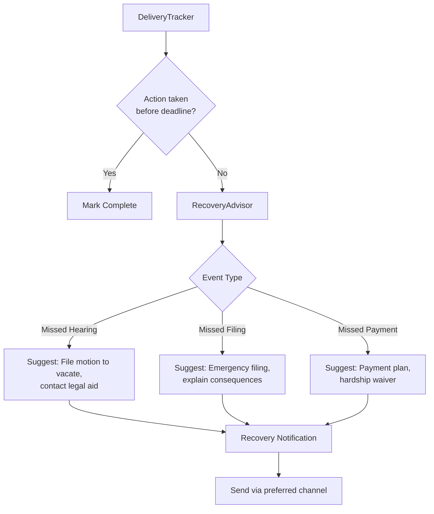

# Court Notification Engine — Architecture

## Overview

The notification engine processes court events (hearings, deadlines, case updates) and delivers timely, plain-language notifications through the most appropriate channel. It supports escalation chains (reminders that increase in urgency) and recovery flows (guidance when an action is missed).

---

## 1. Notification Pipeline

Every notification flows through a consistent pipeline: event intake, template rendering, channel routing, delivery, and tracking.

---

## 2. Channel Routing

The channel router selects the best delivery channel based on user preferences, urgency level, and message type. Users can set preferred channels per notification type.

---

## 3. Escalation Logic

Escalation chains send a sequence of reminders with increasing urgency as a deadline approaches. If the user acknowledges a reminder, the remaining chain is cancelled.

---

## 4. Recovery Flow

When the delivery tracker detects that a deadline has passed without user acknowledgment, the recovery advisor generates context-specific suggestions for next steps.

---

## Data Flow Summary

1. **Event sources** (court calendars, case updates) feed events into the engine
2. **Notification engine** determines urgency and routes to the template engine
3. **Template engine** renders plain-language messages
4. **Channel router** selects SMS, email, push, or in-app based on preferences + urgency
5. **Delivery tracker** monitors opens, clicks, and acknowledgments
6. **Recovery advisor** intervenes with helpful suggestions when deadlines are missed
