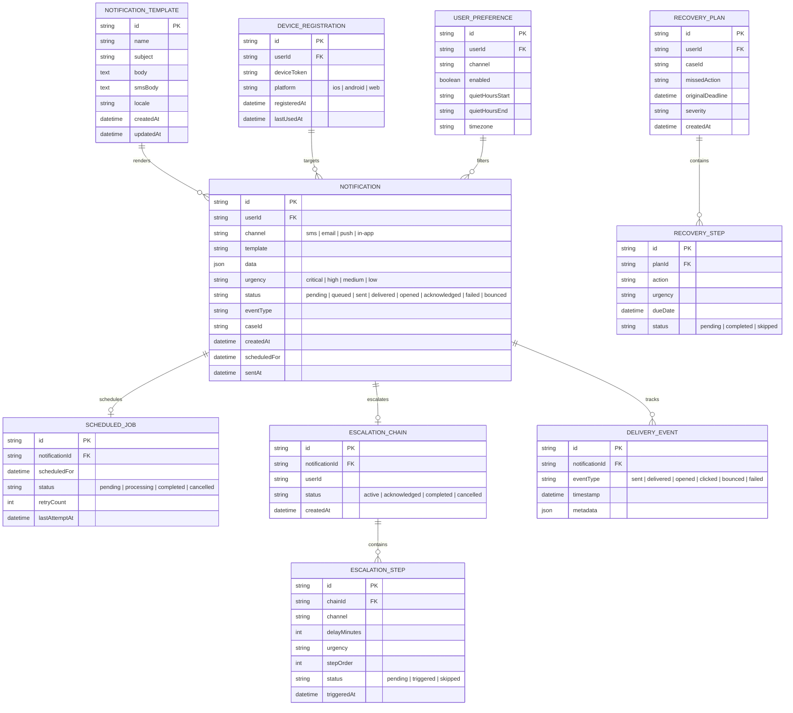

# Court Notification Engine Data Model

## Entity Relationship Diagram

## Key Relationships

- A **Notification** represents a single message sent (or to be sent) to a user via a specific channel
- **Scheduled Jobs** manage future delivery of notifications with retry logic
- **Escalation Chains** define a sequence of increasingly urgent notifications when earlier ones go unacknowledged
- **Delivery Events** form an audit trail of what happened to each notification (sent, opened, bounced, etc.)
- **Templates** define reusable message formats with variable interpolation for different channels
- **Device Registrations** track push notification tokens per user and platform
- **User Preferences** control per-channel opt-in/opt-out and quiet hours
- **Recovery Plans** are created when deadlines are missed, containing ordered recovery steps
